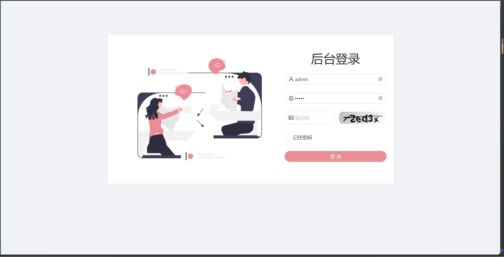
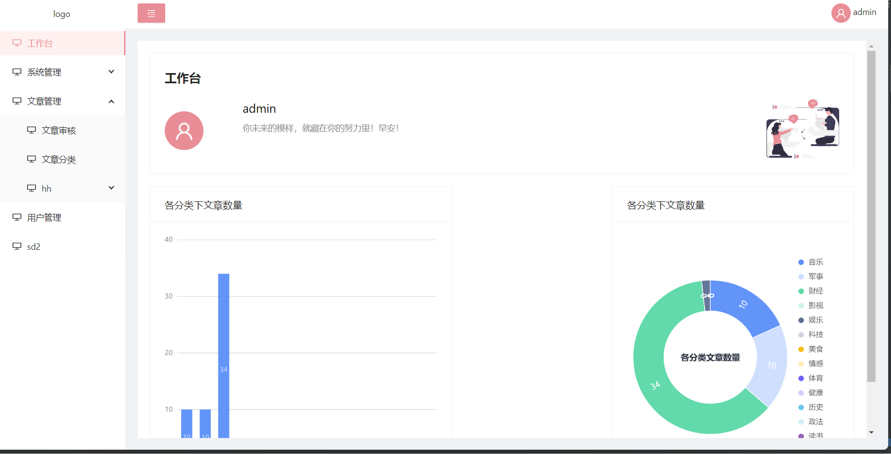
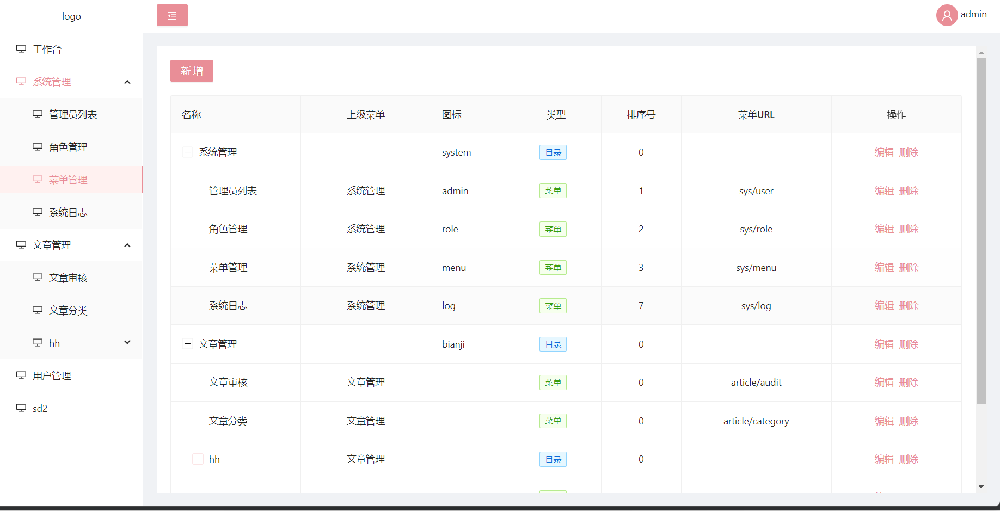
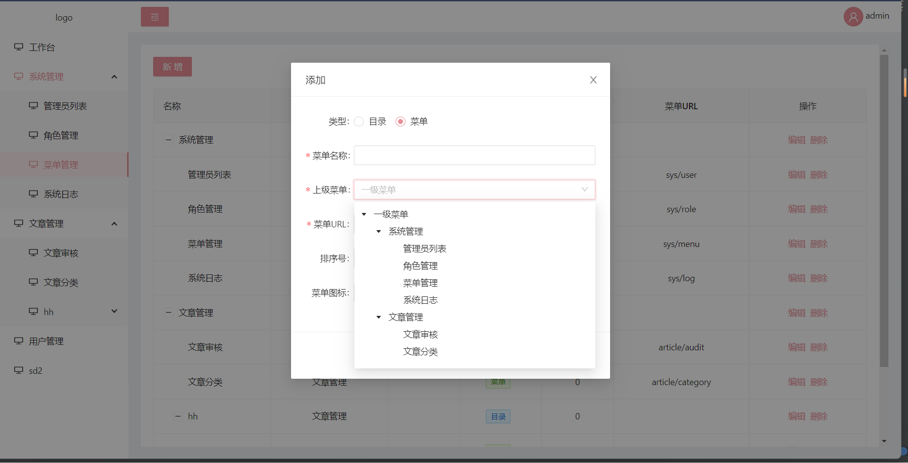
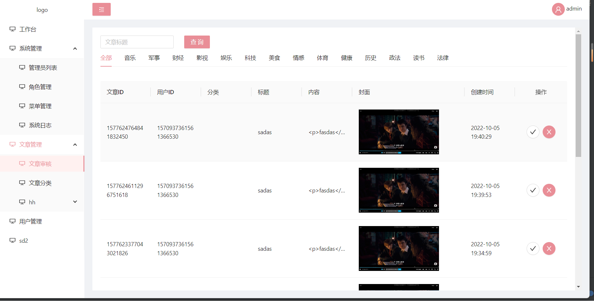

# 该项目为个人毕业设计web端，其主要目的为配合小程序端管理后台数据。

## Getting Started

Install dependencies,

```sh
$ yarn
```

Start the dev server,

```sh
$ yarn start
```

## 项目主要内容:

### 动态路由&菜单

主要代码：

```typescript
  // src/app.tsx
  export async function render(oldRender: Function) {
  // 判断是否添加动态路由且当前路由不为登录页
  if (
    // @ts-ignore
    !global.isAddDynamicMenuRoutes &&
    history.location.pathname !== LOGIN_PATH &&
    (await getInitialState())
  ) {
    const { code, menuList, permissions } =
      (await defaultApi.reqSideBarMenu()) as MenuResType;
    const app = getDvaApp();
    if (code && code === 0) {
      // 添加动态路由
      fnAddDynamicMenuRoutes(menuList);
      // @ts-ignore
      global.isAddDynamicMenuRoutes = true;
      sessionStorage.setItem('menuList', JSON.stringify(menuList || '[]'));
      sessionStorage.setItem(
        'permissions',
        JSON.stringify(permissions || '[]'),
      );
      // 获取dva实例
      console.log(app);
      app &&
      app._store.dispatch({
        type: 'menu/setMenuList',
        payload: menuList,
      });
    } else {
      sessionStorage.setItem('menuList', '[]');
      sessionStorage.setItem('permissions', '[]');
      app &&
      app._store.dispatch({
        type: 'menu/setMenuList',
        payload: [],
      });
    }
  }
  if (oldRender) oldRender();
}
  
  /**
 *
 * @param menuList 菜单列表
 * @param routes 涤葵创建的动态(菜单)路由
 */
const fnAddDynamicMenuRoutes = (
  menuList: API.menuType[],
  routes: API.routeType[] = [],
) => {
  let temp: API.menuType[] = [];
  for (let i = 0; i < menuList.length; i++) {
    if (menuList[i].list && menuList[i].list.length >= 1) {
      temp = temp.concat(menuList[i].list);
    } else if (menuList[i].url && /\S/.test(menuList[i].url)) {
      menuList[i].url = menuList[i].url.replace(/^\//, '');
      var route: API.routeType = {
        path: `/${menuList[i].url}`,
        component: null,
        title: menuList[i].name,
        name: menuList[i].url.replace('/', '-'),
        meta: {
          menuId: menuList[i].menuId,
          isDynamic: true,
        },
      };
      try {
        route['component'] = dynamic({
          loader: () => {
            let result = import(`@/pages/${menuList[i].url}`);
            return result
              .then((result) => {
                // 如果页面存在则正常返回页面路径
                return import(
                  /* webpackChunkName: "dynamic_component" */ `@/pages/${menuList[i].url}`
                  );
              })
              .catch((e) => {
                // 页面不存在，默认返回temp页面
                return import(/* webpackChunkName: "temp" */ `@/pages/temp`);
              });
          },
          loading: Loading,
        });
      } catch (e) {
      }
      routes.push(route);
    }
  }
  if (temp.length >= 1) {
    fnAddDynamicMenuRoutes(temp, routes);
  } else {
    extraRoutes = routes;
    sessionStorage.setItem(
      'dynamicMenuRoutes',
      JSON.stringify(extraRoutes || '[]'),
    );
  }
};
  // src/components/SideBar/index.tsx
  // 动态菜单
  
  // 获取子菜单
  const getSubMenu = (
    menuList: API.menuType[] = [],
    itemList: MenuItem[] = [],
  ): any => {
    for (let i = 0; i < menuList.length; i++) {
      if (menuList[i].list && menuList[i].list.length >= 1) {
        itemList.push(
          getItem(
            menuList[i].name,
            menuList[i].menuId,
            <DesktopOutlined />,
            getSubMenu(menuList[i].list),
          ),
        );
      } else {
        itemList.push(
          getItem(
            menuList[i].name,
            `/${menuList[i].url.replace(/^\//, '')}`,
            <DesktopOutlined />,
          ),
        );
      }
    }
    return itemList;
  };
  // 递归渲染菜单
  const items: MenuItem[] = [
    getItem('工作台', '/home', <DesktopOutlined />),
  ].concat(
    menu.menuList.map((item, index) => {
      // 是否含有子菜单
      if (item.list.length >= 1) {
        return getItem(
          item.name,
          item.menuId,
          <DesktopOutlined />,
          getSubMenu(item.list),
        );
      } else {
        return getItem(
          item.name,
          `/${item.url.replace(/^\//, '')}`,
          <DesktopOutlined />,
        );
      }
    }),
  );
```

菜单级别权限认证

主要代码：

```typescript
// src/app.tsx

// 初始化全局state及查询当前用户
export async function getInitialState(): Promise<{
  setting?: Partial<LayoutSettings>;
  currentUser?: API.UserInfoType;
  queryCurrentUser?: () => Promise<API.UserInfoType | undefined>;
}> {
  const queryCurrentUser = async () => {
    try {
      const data = (await defaultApi.reqUserInfo()) as resUserInfoType;
      return data.user;
    } catch (error) {
      history.push(LOGIN_PATH);
    }
    return undefined;
  };
  // 如果是登录页面，不执行
  if (history.location.pathname !== LOGIN_PATH) {
    const currentUser = await queryCurrentUser();

    return {
      currentUser,
      queryCurrentUser,
    };
  }
```

<br/>

## 技术选型:react+webpack+dva+umi3+Ts+less等

## 主要页面展示

登录页



主页



系统管理/菜单管理



新增/编辑菜单



文章管理/文章审核



## 项目亮点：

模仿人人快速开发平台动态路由&菜单和权限认证设计

## 项目成果:

提高个人技术储备
将已学技术复习实践
